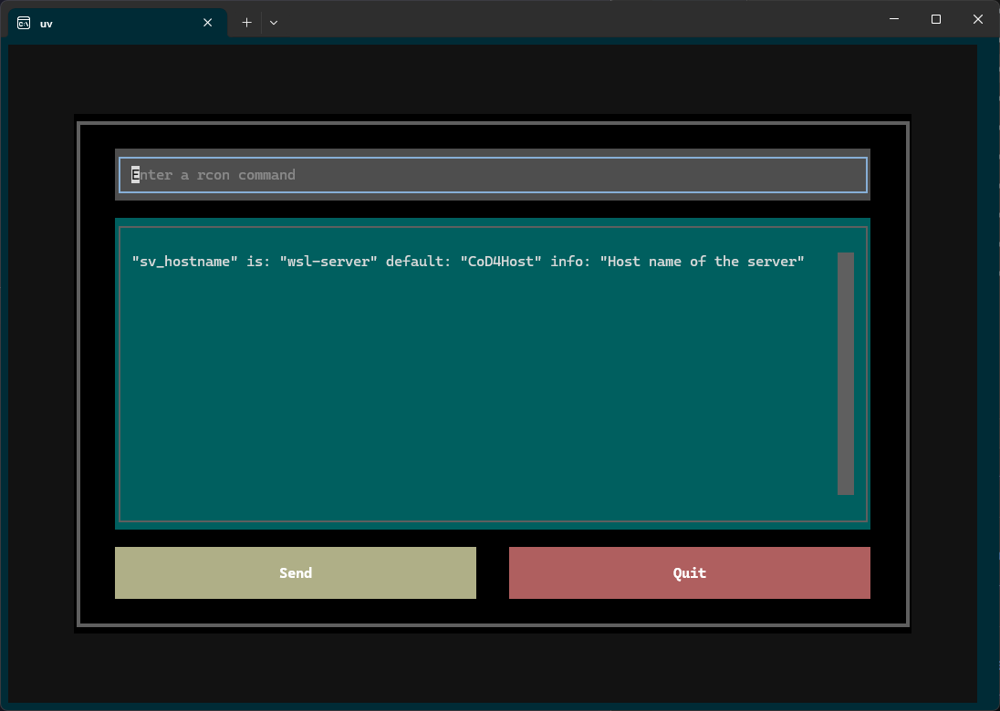

# q3rcon tui

[](https://github.com/pypa/hatch)
[](https://github.com/astral-sh/ruff)
[](https://pypi.org/project/q3rcon-tui)
[](https://pypi.org/project/q3rcon-tui)

-----



## Table of Contents

- [Installation](#installation)
- [License](#license)

## Installation

*with uv*

```console
uv tool install q3rcon-tui
```

*with pipx*

```console
pipx install q3rcon-tui
```

The TUI should now be discoverable as q3rcon-tui.

## Configuration

#### Flags

Pass `--host`, `--port` and `--password` as flags:

```console
q3rcon-tui --host=localhost --port=28960 --password=rconpassword
```

#### Environment Variables

Store and load from dotenv files located at:
-   .env in the cwd
-   user home directory / .config / rcon-tui / config.env

example .env:

```bash
Q3RCON_TUI_HOST=localhost
Q3RCON_TUI_PORT=28960
Q3RCON_TUI_PASSWORD=rconpassword
Q3RCON_TUI_REFRESH_OUTPUT=true
```

## License

`q3rcon-tui` is distributed under the terms of the [MIT](https://spdx.org/licenses/MIT.html) license.
